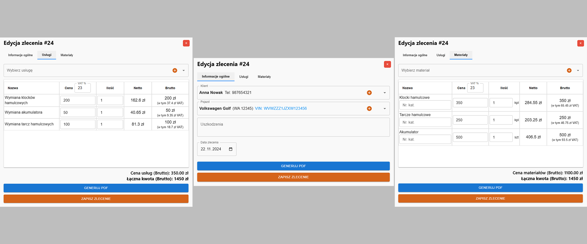
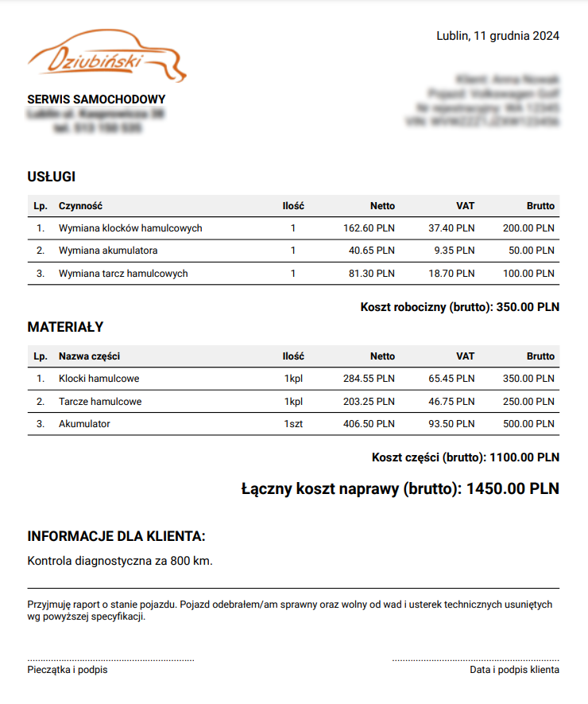

# System Zarządzania Wycenami Warsztatu Samochodowego

## Opis Projektu

Aplikacja webowa do kompleksowego zarządzania warsztatem samochodowym, która umożliwia:
- Rejestrację i logowanie użytkowników
- Zarządzanie zleceniami napraw
- Prowadzenie bazy klientów
- Operacje CRUD dla zleceń, klientów, pojazdów, usług i materiałów

## Funkcje Główne

### 1. Autoryzacja Użytkowników

- Rejestracja nowych użytkowników (tylko pracownicy firmy)
- Logowanie za pomocą Supabase Authentication
- Przesyłanie e-mail'i poprzez serwis Resend
- Bezpieczny dostęp do systemu

### 2. Panel Nawigacyjny

- Przyciski nawigacji między sekcjami aplikacji
- Opcja wylogowania

### 3. Zarządzanie Danymi

#### Tabele:
- Zlecenia
- Klienci
- Pojazdy
- Usługi
- Materiały

### 4. Formularz Zleceń

#### Kluczowe funkcjonalności formularza:
- Wybór klienta z listy lub dodanie nowego
- Wybór pojazdu z listy lub dodanie nowego
- Dodawanie usług do zlecenia
- Dodawanie materiałów do zlecenia
- Dynamiczne obliczanie cen
- Zapis zlecenia w bazie danych Supabase
- Generowanie PDF zlecenia

## Technologie

- React
- Node.js
- Supabase 
- Resend

- ## Autor

- **Projektant aplikacji**: Paweł Jabłoniec
- **Dla firmy**: Serwis Samochodowy DZIUBIŃSKI PIOTR

## Licencja

Projekt jest prywatną własnością firmy DZIUBIŃSKI PIOTR.
